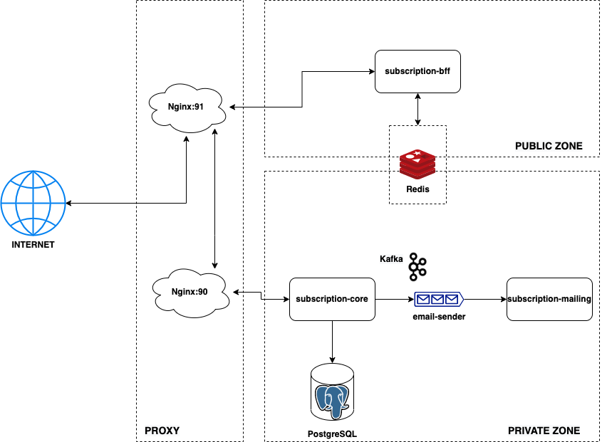
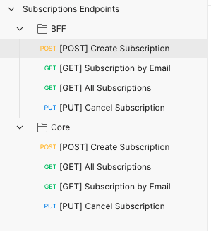
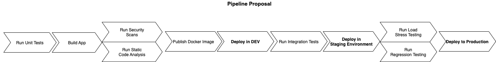

# Subscription Challenge

## Purpose
Provide a **re-usable**, **scalable**, **resilient**, **secure** and **fast** solution in a micro-service back-end architecture to enable users to subscribe to receive updates from a newsletter they choose to subscribe.

## Description
| Service  | Description |
| ------------- | ------------- |
| **Subscription Core**  | Background worker that handles business logics and make operations of persistance of all incoming and outcoming data  |
| **Subscription BFF**  | Backend-for-Front-end responsible for accepting and transforming incoming subscription requests from internet   |
| **Subscription Mailing**  | Background service responsible for sending e-mail notification for new subscribers **(Mocked)**  |


## Architecture


### Network
The system is mainly divided in two zones where network rules for security would be applied differently independently. 
A proxy layer managed with nginx sits between the communication for handling resources during high loads, currently only for both Core and BFF services, in which only the port for BFF is publicly available.

### Domain
Aiming to reach scalability and resilience, the developed microsservices follow an *async-first* communication between them, by making use of resources to decouple the need of waiting for a response from other services. 

The communication between **subscription-core** and **subscription-mailing**, for example, happens asynchronously via a Kafka topic, in which the mailing service can handle at a later time in a case of a system's disaster.

Although **subscription-bff** and **subscription-core** communicate via sync REST endpoints, there are implemented strategies to lower the impact on system's availability, such as providing an 201 ACCEPT message and leaving the background services handle its request as needed. 

In terms of performance, a caching strategy was implemented in the **subscription-bff** GET endpoints to achieve SLA's response times.

## Available Use Cases
1. A new customer can subscribe to a newsletter by providing its information
2. An user can check all current subscriptions (either active or not)
3. An user can check details of a single subscription
4. An user is able to choose to leave deactivate its subscription.

## Projects structure
```
├── subscription-bff
│   ├── src
│   │   ├── clients        
│   │   ├── config         
│   │   ├── controllers    
│   │   ├── dtos
│   │   ├── exceptions
│   │   ├── handlers
│   │   ├── interfaces
│   │   ├── dtos
│   │   ├── middlewares
│   │   ├── routes
│   │   ├── services
│   │   ├── app.ts
│   │   ├── server.ts
│   ├── tests
│   │   ├── hooks
│   │   ├── src
│   │   │   ├── routes
│   │   │   ├── services
│   ├── package.json
│   ├── Dockerfile
├── subscription-core
│   ├── src
│   │   ├── config         
│   │   ├── connections        
│   │   ├── controllers    
│   │   ├── dtos
│   │   ├── entities
│   │   ├── exceptions
│   │   ├── http
│   │   ├── interfaces
│   │   ├── middlewares
│   │   ├── migration
│   │   ├── producers
│   │   ├── routes
│   │   ├── services
│   │   ├── tests
│   │   ├── utils
│   │   ├── app.ts
│   │   ├── server.ts
│   ├── package.json
│   ├── Dockerfile
├── subscription-mailing
│   ├── src
│   │   ├── config      
│   │   ├── connections         
│   │   ├── consumers    
│   │   ├── interfaces
│   │   ├── model
│   │   ├── services
│   │   ├── utils
│   │   ├── app.ts
│   │   ├── server.ts
│   │   ├── routes
│   │   ├── services
│   │   ├── app.ts
│   │   ├── server.ts
│   ├── tests
│   │   ├── consumers
│   ├── package.json
│   ├── Dockerfile
├── dist/
├── node_modules/
├── docker-compose.yaml
├── resources/
└── postman/
```
## Building and Running locally
### Requirements
 - NodeJs 14.15.0^. Instructions on [how to install](https://nodejs.org/en/download/package-manager/), depending on your OS
 - [Yarn](https://classic.yarnpkg.com/lang/en/docs/install/#mac-stable)
 - [Docker](https://docs.docker.com/get-docker/)
 - [Docker compose](https://docs.docker.com/compose/install/)

### Running Tests
From your terminal, go into the target project and run `yarn test`

Example:
```
   cd subscription-core
   yarn test
```
### Running Locally

1. Clone this repository

```
git clone https://github.com/palaciowagner/subscription-challenge.git
```

2. Start Docker
3. From the project root folder, either run

```
docker-compose up
```
or

```
make start-dev
```

All infra-structure components and services should startup. This may take a few minutes, depending on your network and resources.

#### Local Access
 - [subscription-core](http://localhost:3000/) - Port number: 3000
 - [subscription-bff](http://localhost:5000/) - Port number: 5000

### API Documentation

For more information about on how to authenticate in endpoints, **after building and running the project locally**, you can access:

Core API Swagger Definition

```
http://localhost:3000/api-docs
```

BFF API Swagger Definition

```
http://localhost:5000/api-docs
```

or

Upload the collection and environment files under the `postman/` folder to [Postman](https://www.postman.com/downloads/) or [Insomnia](https://insomnia.rest/) apps.
You should be able to see all REST endpoints after loading, like in the screenshot below.



### Relevant Tech Stack
 - NodeJs / Typescript
    - [**express**](https://www.npmjs.com/package/express) - NodeJs web framework
    - [**jest**](https://jestjs.io/) - Testing framework
    - [class-validator](https://github.com/typestack/class-validator) - Decorator-based validation lib
    - [class-transformer](https://github.com/typestack/class-transformer) - Class serializer/deserializer
    - [**kafkajs**](https://kafka.js.org/) - Apache Kafka client for Node.Js
    - [bcrypt](https://www.npmjs.com/package/bcrypt) - Lib for password hashing, used for generating API token.
    - [dotenv](https://www.npmjs.com/package/dotenv) - Environment variables loader
    - [**express-redis-cache**](https://github.com/rv-kip/express-redis-cache) - Caching middleware for Redis client. Used for caching API responses.
    - [winston](https://github.com/winstonjs/winston) - Logger library.
    - [swagger-jsdoc](https://www.npmjs.com/package/swagger-jsdoc) - OpenAPI Swagger specification generator
    - [**TypeORM**](https://typeorm.io/#/) - Node.js ORM for data persistance.
    - [axios](https://github.com/axios/axios) - HTTP client for downstream communication.
    - [cookie-parser](https://www.npmjs.com/package/cookie-parser) - Middlware for managing cookies. Used for Authentication
    - [helmet](https://www.npmjs.com/package/helmet) - Express middleware for HTTP headers security prevention
    - [compression](https://www.npmjs.com/package/compression) - Compression middleware for files bundling
    - [**jsonwebtoken**](https://www.npmjs.com/package/jsonwebtoken) - Used for JWT generation and validation for REST endpoints
    - [hpp](https://www.npmjs.com/package/hpp) - Express middleware to avoid HTTP parameter pollution attacks
    - [**typescript-express-starter**](https://www.npmjs.com/package/typescript-express-starter) - Express RESTful API boilerplate with Typescript
 - [Docker](https://docs.docker.com/get-docker/) - For service's containerazitation
 - [PostgreSQL](https://www.postgresql.org/) - Relational Database for data persistance
 - [Kafka](https://kafka.apache.org/) - For distributed event sourcing and decoupling
 - [Redis](https://redis.io/) - In-memory data store used for cache handling
 - [Nginx](https://www.nginx.com/) - Web server used as reverse proxy and enable future k8s deployment

 ### CI/CD
 There's no current pipeline implementation available for this project, but the project was developed following a [Trunk-Based Development approach](https://www.atlassian.com/continuous-delivery/continuous-integration/trunk-based-development), already thinking on a software development process that leads into a Countinuous Integration and Development Lifecycle. 

Below there's a pipeline proposal for this project



The pipeline would be replicated for all three services. 
The deployment steps could start as manual steps, but the intention is to increase system's testing realiabilty and automatization in order to make the deployment process more fluid and secure.

## Possible Next Steps
 - Minor bug fixes
 - Enable database caching to improve performance on subscription-core
 - Implement Integrated and E2E tests for interoperability between services
 - Tweak configuration for prod deployment configuration
 - Secure passwords and environment variables
 - Make better usage of CORS and private vs. public networking
 - Implement retry mechanism / circuit breaker over kafka producers to improve system's resilience.
 - Setup pipelines
 - Setup Kubernetes clusters for deployment.